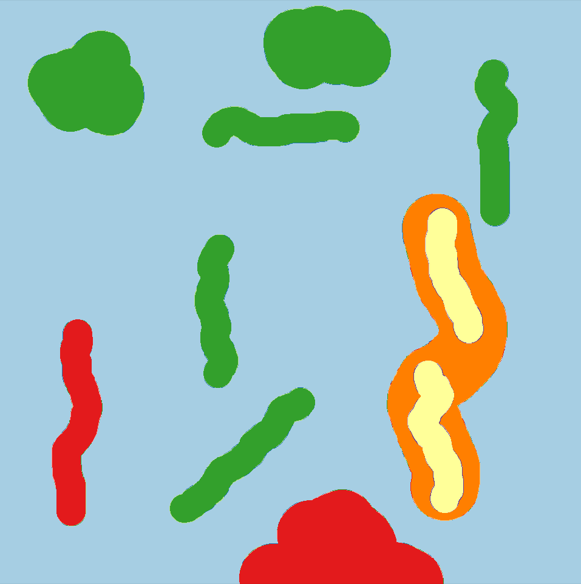

# SeSeCoCo
Semantic Segmentation Comparator using Components

* Count and compare connected components
* Count correctly detected component TP (recall threshold)
* Count badly detected component FN (recall threshold)
* Count over detecting component FP (precision threshold)

### Example

Example of SeSeCoCo running on dummy example. Precision and recall threshold are set to 0.40.

| Result | Y True | Y Pred|
|-|-|-|
||||
* Green = TP
* Red = FN
* Orange = FP (over detecting)
* Yellow = TP in FP component

```
SeSeCoCo : Semantic Segmentation Comparator using Components
Segmentation 1 (y_true)
Connected Components 10
Correctly detected components 8
Not detected components (too small or not enough recall) 2
Segmentation 2 (y_pred)
Connected Components 7
Over detecting components (too large or not enough precision) 1
```
