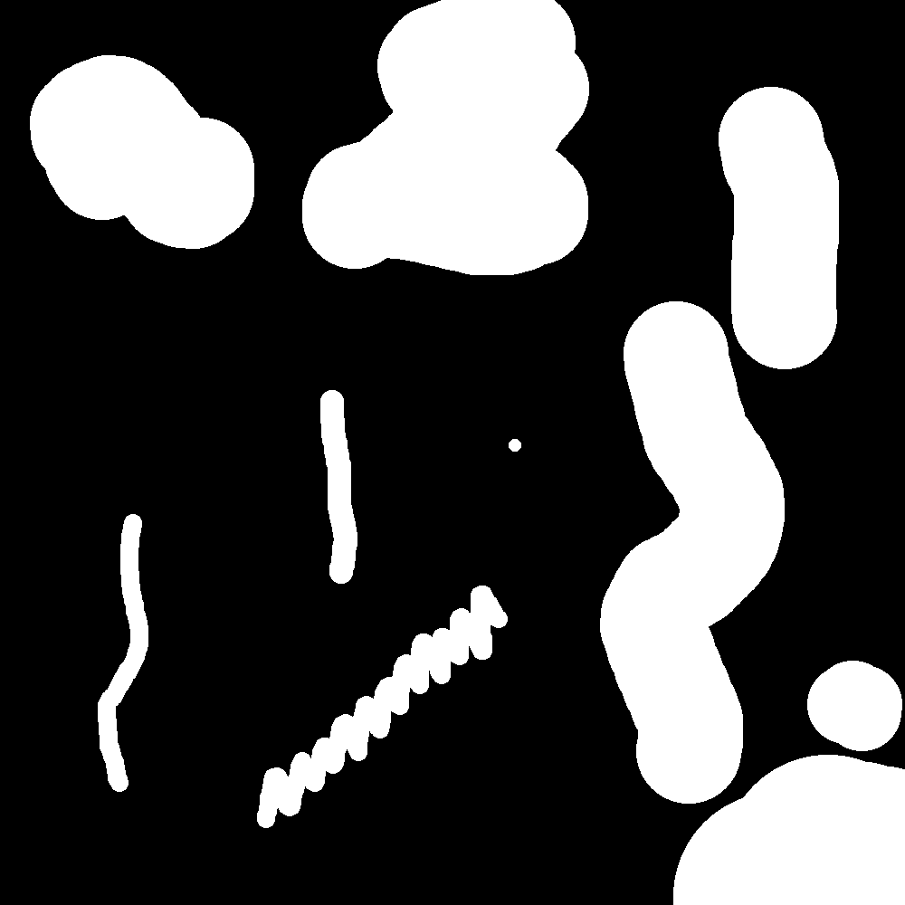

# SeSeCoCo
Semantic Segmentation Comparator using Components

* Count and compare connected components
* Count correctly detected component TP (recall threshold)
* Count badly detected component FN (recall threshold)
* Count over detecting component FP (precision threshold)

### Example

Example of SeSeCoCo running on dummy example. Precision and recall threshold are set to 0.40.

| Result | Y True | Y Pred|
|-|-|-|
||||
* Green = TP
* Red = FP
* Blue = FN
* Yellow = over detected
* Orange = under detected (part of object which is correctly detected, in a larger cyan component)
* Cyan = under detected
* Sky Bluy = background

```
SeSeCoCo : Semantic Segmentation Comparator using Components
Segmentation 1 (y_true)
Connected Components 12
Correctly detected components 8
False negative components 1
Under detected components (too small or not enough recall) 3
Segmentation 2 (y_pred)
Connected Components 10
False positive components 1
Over detecting components (too large or not enough precision) 2
```
